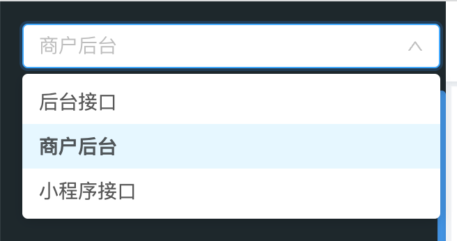

## 安装方式
```js
npm install api_gen_type --dev
```

## 使用方式

在项目的根目录新建文件
gen.config.json

```json
配置示例
{
  "categoryName": "后台接口",
  "baseUrl": "http://api.live-mall.nodewebapp.com",
  "genBase": {
    "apiFileDir": "gen_api",
    "typeFileDir": "gen_type"
  }
}
```

categoryName 填入如下图所示文字即可


apiFileDir/typeFileDir
是产出的文件的目录，可以使用相对路径来指定
```js
./src/gen_api
./src/xxx
```

## 运行程序
```js
npx gen
```

或者在项目中的 package.json 中配置script
```json
 "xxx": "gen"
```
使用 npm run xxx 即可